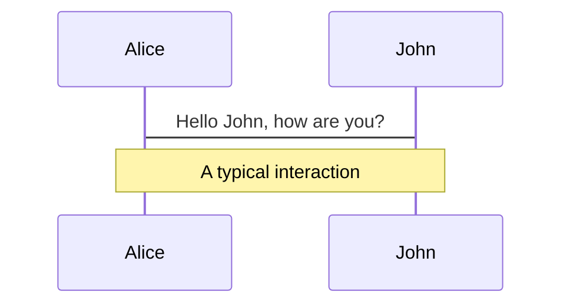
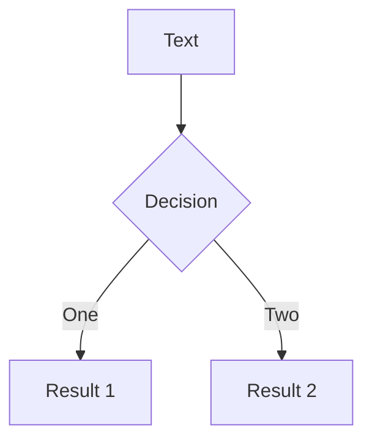
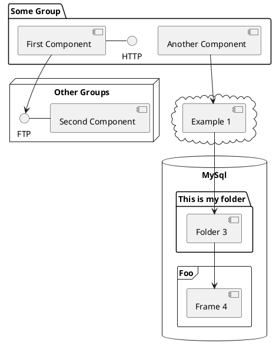

---
# try also 'default' to start simple
theme: dracula
# random image from a curated Unsplash collection by Anthony
# like them? see https://unsplash.com/collections/94734566/slidev
background: https://source.unsplash.com/collection/94734566/1920x1080
# apply any windi css classes to the current slide
class: 'text-center'
# https://sli.dev/custom/highlighters.html
highlighter: shiki
# show line numbers in code blocks
lineNumbers: false
# some information about the slides, markdown enabled
info: |
  ## Slidev Starter Template
  Presentation slides for developers.

  Learn more at [Sli.dev](https://sli.dev)
# persist drawings in exports and build
drawings:
  persist: false
# use UnoCSS (experimental)
css: unocss
---

# Strip Clustering with HLS for FPGA 

Slides by: Hayden Shaddix 

06/11/2024

<div class="pt-12">
  <span @click="$slidev.nav.next" class="px-2 py-1 rounded cursor-pointer" hover="bg-white bg-opacity-10">
     Press Space for next page <carbon:arrow-right class="inline"/>
  </span>
</div>

<div class="abs-br m-6 flex gap-2">
  <button @click="$slidev.nav.openInEditor()" title="Open in Editor" class="text-xl icon-btn opacity-50 !border-none !hover:text-white">
    <carbon:edit />
  </button>
  <a href="https://github.com/slidevjs/slidev" target="_blank" alt="GitHub"
    class="text-xl icon-btn opacity-50 !border-none !hover:text-white">
    <carbon-logo-github />
  </a>
</div>

<!--
The last comment block of each slide will be treated as slide notes. It will be visible and editable in Presenter Mode along with the slide. [Read more in the docs](https://sli.dev/guide/syntax.html#notes)
-->

---

# Talk Contents 

- **Introduction** - Little bit about me 
- **FPGA** - Pipeline, why FPGAs? 
- **HLS** - Why HLS rather than other formats? How does it fit? 
- **I/O of Expected Kernel** - embedding Vue components to enhance your expressions
- **General Algorithm Overview** - Logic flow and important cases 
- **Testing** - Troubleshooting, Test Bench, optimization 
- **Kernelization** - Progress/Process 

<br>
<br>

<!--
You can have `style` tag in markdown to override the style for the current page.
Learn more: https://sli.dev/guide/syntax#embedded-styles
-->

<style>
h1 {
  background-color: #2B90B6;
  background-image: linear-gradient(45deg, #4EC5D4 10%, #146b8c 20%);
  background-size: 100%;
  -webkit-background-clip: text;
  -moz-background-clip: text;
  -webkit-text-fill-color: transparent;
  -moz-text-fill-color: transparent;
}
</style>

---

# Introduction

Hello!! I'm Hayden and here's a little bit about me: 

- Graduated from FSU in 2023 
- Current NIU grad student 
- Currently working on QT as part of $CP^2$ traineeship 
  - Writing firmware using HLS for use in FPGA pipeline 
  - Goal is to take in hit data and output clusters of adjacent hits quickly  
<div style="float: right; width: 40%;">
  
</div>
--- 

# FPGA
Use code snippets and get the highlighting directly!
---

# HLS 
Clustering algorithm is written in HLS for efficiency 

**Why?**
- Parallelism 
- Efficient handling of data stream input and output 
- Less storage necessary and higher iteration frequency 
- Good for kernelization and inclusion into general FPGA pipeline 

Have continued to learn HLS pretty actively using AMD tutorials and other resources: 

<style>
  .split {
    display: flex;
    justify-content: space-between;
  }
  .left {
    flex: 1;
    padding-right: 20px;
  }
  .right {
    flex: 1;
    padding-left: 20px;
  }
  .right img {
    width: 100%;
    height: auto;
  }
</style>

<div class="split">
  <div class="left">
    <!-- Left side content with link -->
    <p>Check out this website: <a href="https://example.com">Example Website</a></p>
  </div>
  <div class="right">
    <!-- Right side content with screenshot -->
    
  </div>
</div>

---

# I/O 
Since this is a piece in a larger pipeline of other kernels in the FPGA, the inputs and outputs are important

<style>
  .slide-small-text {
    font-size: 0.8em; /* Adjust the size as needed */
  }
</style>

<div class="slide-small-text">

**Inputs**
- Clusters with a position and bitmask 
  - <u>Position</u>
    - ABCStar chip 
    - Strip number 
  - <u>Bitmask</u>
**Need to add something about the actual step in the pipeline before mine that gives me this info**

**Outputs**
- Clusters with position and size 
  - <u>Position</u>
    - ABCStar chip 
    - Strip number 
  - <u>Size</u>
- Output is based off of adjacency of hits in completely local coordinates 
</div>

---

# Animations

Animations are powered by [@vueuse/motion](https://motion.vueuse.org/).

```html
<div
  v-motion
  :initial="{ x: -80 }"
  :enter="{ x: 0 }">
  Slidev
</div>
```

<div class="w-60 relative mt-6">
  <div class="relative w-40 h-40">
    
    
    
  </div>

  <div
    class="text-5xl absolute top-14 left-40 text-[#2B90B6] -z-1"
    v-motion
    :initial="{ x: -80, opacity: 0}"
    :enter="{ x: 0, opacity: 1, transition: { delay: 2000, duration: 1000 } }">
    Slidev
  </div>
</div>

<!-- vue script setup scripts can be directly used in markdown, and will only affects current page -->
<script setup lang="ts">
const final = {
  x: 0,
  y: 0,
  rotate: 0,
  scale: 1,
  transition: {
    type: 'spring',
    damping: 10,
    stiffness: 20,
    mass: 2
  }
}
</script>

<div
  v-motion
  :initial="{ x:35, y: 40, opacity: 0}"
  :enter="{ y: 0, opacity: 1, transition: { delay: 3500 } }">

[Learn More](https://sli.dev/guide/animations.html#motion)

</div>

---

# LaTeX

LaTeX is supported out-of-box powered by [KaTeX](https://katex.org/).

<br>

Inline $\sqrt{3x-1}+(1+x)^2$

Block
$$
\begin{array}{c}

\nabla \times \vec{\mathbf{B}} -\, \frac1c\, \frac{\partial\vec{\mathbf{E}}}{\partial t} &
= \frac{4\pi}{c}\vec{\mathbf{j}}    \nabla \cdot \vec{\mathbf{E}} & = 4 \pi \rho \\

\nabla \times \vec{\mathbf{E}}\, +\, \frac1c\, \frac{\partial\vec{\mathbf{B}}}{\partial t} & = \vec{\mathbf{0}} \\

\nabla \cdot \vec{\mathbf{B}} & = 0

\end{array}
$$

<br>

[Learn more](https://sli.dev/guide/syntax#latex)

---

# Diagrams

You can create diagrams / graphs from textual descriptions, directly in your Markdown.

<div class="grid grid-cols-3 gap-10 pt-4 -mb-6">







</div>

[Learn More](https://sli.dev/guide/syntax.html#diagrams)


---
layout: center
class: text-center
---

# Learn More

[Documentations](https://sli.dev) · [GitHub](https://github.com/slidevjs/slidev) · [Showcases](https://sli.dev/showcases.html)
