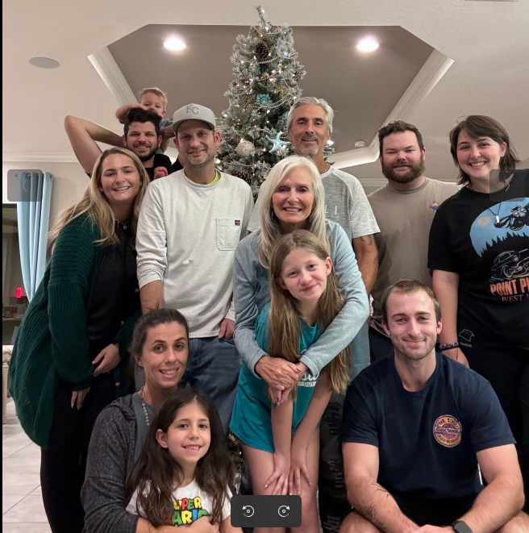
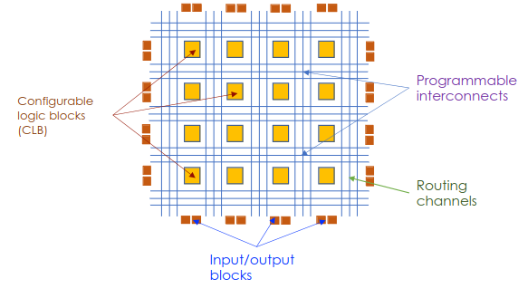
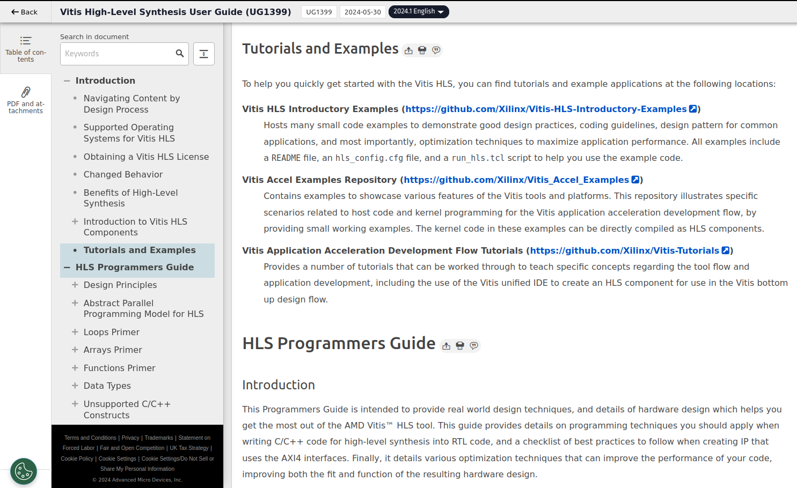
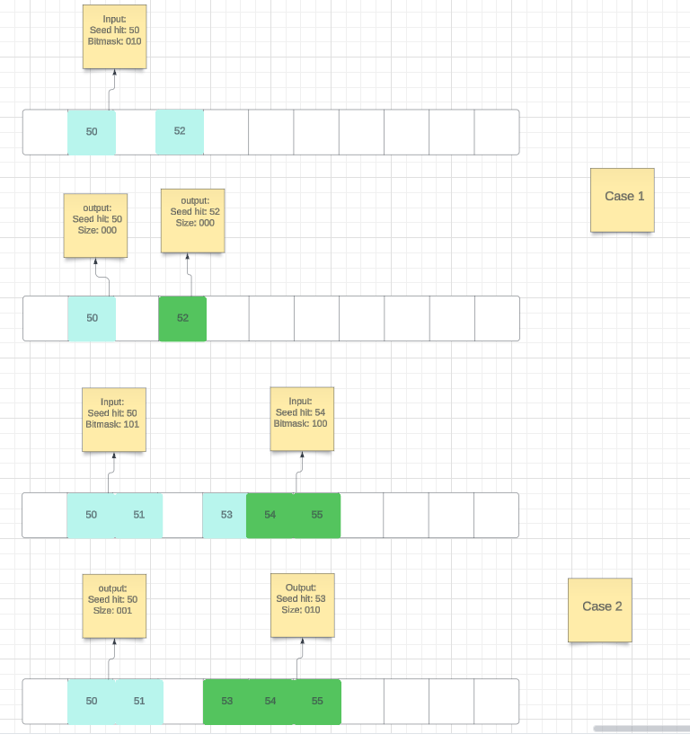
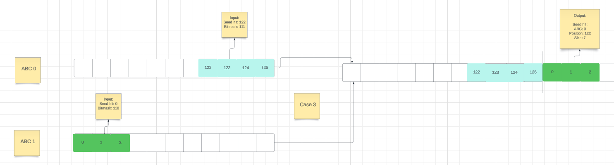
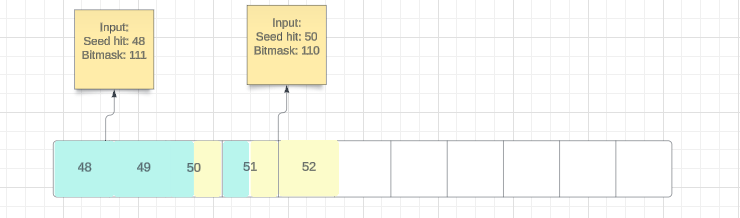

---
# try also 'default' to start simple
theme: dracula
# random image from a curated Unsplash collection by Anthony
# like them? see https://unsplash.com/collections/94734566/slidev
background: https://source.unsplash.com/collection/94734566/1920x1080
# apply any windi css classes to the current slide
class: 'text-center'
# https://sli.dev/custom/highlighters.html
highlighter: shiki
# show line numbers in code blocks
lineNumbers: false
# some information about the slides, markdown enabled
info: |
  ## Slidev Starter Template
  Presentation slides for developers.

  Learn more at [Sli.dev](https://sli.dev)
# persist drawings in exports and build
drawings:
  persist: false
# use UnoCSS (experimental)
css: unocss
---

# Strip Clustering with HLS for FPGA 

Slides by: Hayden Shaddix 

06/11/2024

  
     Press Space for next page <carbon:arrow-right class="inline"/>
  

  <button @click="$slidev.nav.openInEditor()" title="Open in Editor" class="text-xl icon-btn opacity-50 !border-none !hover:text-white">
    <carbon:edit />
  </button>
  <a href="https://github.com/slidevjs/slidev" target="_blank" alt="GitHub"
    class="text-xl icon-btn opacity-50 !border-none !hover:text-white">
    <carbon-logo-github />
  </a>

---

# Talk Contents 

- **Introduction** - Little bit about me 
- **FPGA** - Pipeline, why FPGAs? 
- **HLS** - Why HLS rather than other formats? How does it fit? 
- **I/O of Expected Kernel** - embedding Vue components to enhance your expressions
- **General Algorithm Overview** - Logic flow and important cases 
- **Testing** - Troubleshooting, Test Bench, optimization 
- **Kernelization** - Progress/Process 

 
 

---

# Introduction

Hello!! I'm Hayden and here's a little bit about me: 

- Graduated from FSU in 2023 
- Current NIU grad student 
- Currently working on QT as part of $CP^2$ traineeship 
  - Writing firmware using HLS for use in FPGA pipeline 
  - Goal is to take in hit data and output clusters of adjacent hits quickly  

  

--- 

# FPGAs

  

    <h2>Why FPGAs are Important</h2>
    
It is important to note why FPGAs specifically are important for this context:

    <ul>
      <li>Parallel Processing</li>
      <li>Customizable and changeable hardware</li>
      <li>Low Latency/Efficiency</li>
      <li>Resource availability (LUT, BRAM, etc.)</li>
      <li>Scalability (multiple kernels)</li>
    </ul>
  

  

    <!-- Replace 'path_to_fpga_diagram.png' with the actual path to your FPGA diagram image -->
    
  

  <a href="https://tac-hep.org/assets/pdf/uw-gpu-fpga/2023-03-22-FPGA-HLS-Lecture-2.pdf" target="_blank">Link to slides: FPGA-HLS Lecture</a>

---

# HLS 
Clustering algorithm is written in HLS for efficiency 

**Why?**
- Parallelism 
- Efficient handling of data stream input and output 
- Less storage necessary and higher iteration frequency 
- Good for kernelization and inclusion into general FPGA pipeline 

Have continued to learn HLS pretty actively using online manuals and resources: 

  

    <!-- Left side content with link -->
    
 <a href="https://docs.amd.com/r/en-US/ug1399-vitis-hls/Tutorials-and-Examples">Vitis AMD Tutorials</a>

  

  

    <!-- Right side content with screenshot -->
    
  

---

# I/O 
Since this is a piece in a larger pipeline of other kernels in the FPGA, the inputs and outputs are important

**Inputs**
- Clusters with a position and bitmask 
  - <u>Position</u>
    - ABCStar chip 
    - Strip number 
  - <u>Bitmask</u>
**Need to add something about the actual step in the pipeline before mine that gives me this info**

**Outputs**
- Clusters with position and size 
  - <u>Position</u>
    - ABCStar chip 
    - Strip number 
  - <u>Size</u>
- Output is based off of adjacency of hits in completely local coordinates 

---

# Clustering Algorithm 

  

    <!-- Left column content -->
    <h2>HLS Algorithm Overview</h2>
    
The HLS algorithm is relatively straightforward in its general structure:

    <ol>
      <li>Takes in cluster information</li>
      <li>Checks adjacency for bitmask cases</li>
      <li>Merges adjacent hits</li>
      <li>Creates new cluster when a hole exists</li>
      <li>Outputs clusters of adjacent hits</li>
    </ol>
  

  

    <!-- Right column content with image -->
    
  

---
---
# Implementation/Application 

## Nuanced Cases in Strip Clustering

  

    <!-- Left column content -->
    
There are a few interesting cases that need to be treated explicitly:

    <ol>
      <li>Gap Cases (holes in the bitmask)</li>
      <li>Clusters across chip boundaries</li>
    </ol>
    
Simpler than pixels, but some nuance depending on the final necessary specifications:

      <ul>
        <li>Overlapping hits</li>
        <li>Merge chip boundary or truncate into separate small clusters</li>
        <li>Smallest possible adjacent clusters (no gaps)</li>
      </ul>
  

  

    <!-- Right column content with images and captions -->
    

      
      
**Merging across ABCStar boundary**

    

    

      
      
**Case with two separate input clusters with overlapping hits**

    

  

---
---

# Testing and Optimization

There are a few important things testing this code as it is developed 

1) C Simulation (Test Bench) 
    - Includes several simple cases defined by the user 
    - Easily manipulated
    - Simple testing of input and outputs 
2) C Synthesis (Vitis)
    - Checks viability of pipelining 
    - Gives practical readings (Latency/clock-cycle, etc)
    - Allows for and suggests optimizations 
3) Test vectors (not yet used)
    - More realistic input 
    - Greater length/variability input stream 

--- 

# Kernelization 
Short long-term goal is for a confined clustering kernel to test with larger FPGA pipeline. From my understanding, there are 3 major components necessary to build the kernel and my current working status on each varies: 

## Project Components and Status

  

    <!-- Left column content with table -->
    <table>
      <thead>
        <tr>
          <th>Components</th>
          <th>Current Status</th>
        </tr>
      </thead>
      <tbody>
        <tr>
          <td>Working HLS</td>
          <td>Still testing, optimization has been the backburner</td>
        </tr>
        <tr>
          <td>Test Bench</td>
          <td>Created already, should be easily adaptable for different cases</td>
        </tr>
        <tr>
          <td>Project file</td>
          <td>Skeleton version in the works, adapting tutorial version to suit the clustering code</td>
        </tr>
      </tbody>
    </table>
  

  

  

---
